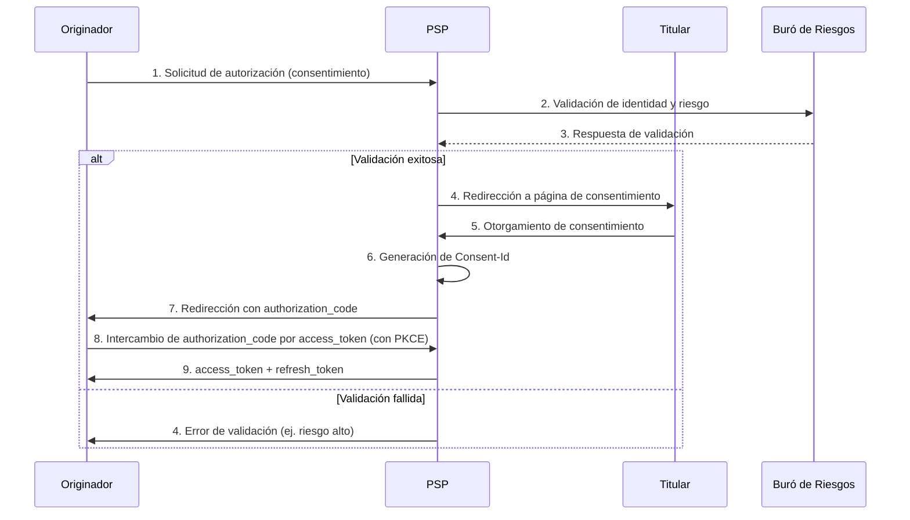

# Flujo de Consentimiento - Open Banking (FAPI/PSD2)

## Descripción General
Este documento describe el flujo de consentimiento para la consulta de cuentas en Open Banking, alineado con los estándares FAPI (Financial-grade API) y PSD2 (Payment Services Directive 2). El flujo garantiza que el titular de la cuenta otorgue su consentimiento explícito antes de que el originador pueda acceder a sus datos.

## Actores
| Actor               | Descripción                                                                                     |
|---------------------|-------------------------------------------------------------------------------------------------|
| **Originador**      | Entidad que solicita el acceso a los datos de la cuenta (ej. AISP - Account Information Service Provider). |
| **PSP**             | Proveedor de Servicios de Pago (ej. banco del titular de la cuenta).                           |
| **Titular**         | Persona física o jurídica dueña de la cuenta bancaria.                                         |
| **Buró de Riesgos** | Sistema externo que valida la identidad y riesgo asociado a la solicitud de consentimiento.    |

## Diagrama de Flujo (BPMN)


## Puntos de Decisión

### 1. Validación de Identidad y Riesgo (Buró de Riesgos)
- **Regla**: El PSP debe validar la identidad del titular y evaluar el riesgo de la solicitud mediante el buró de riesgos.
- **Criterios**:
  - **Identidad**: Verificación de datos biométricos o credenciales (ej. 2FA).
  - **Riesgo**: Puntuación de riesgo basada en historial de transacciones, ubicación geográfica y comportamiento.
- **Manejo de Fallos**:
  - Si la validación falla → PSP rechaza la solicitud (código `403 Forbidden`).
  - Si el buró no responde en **2 segundos** → PSP continúa con validación local (degradación controlada).

### 2. Otorgamiento de Consentimiento (Titular)
- **Regla**: El titular debe otorgar consentimiento explícito para cada scope solicitado (`accounts`, `balances`, `transactions`).
- **Detalles del Consentimiento**:
  - **Scopes**: Lista de permisos solicitados (ej. `accounts:read`, `balances:read`).
  - **Duración**: Máximo **90 días** (requisito PSD2).
  - **Revocabilidad**: El titular puede revocar el consentimiento en cualquier momento.
- **Manejo de Fallos**:
  - Si el titular rechaza el consentimiento → PSP redirige al originador con error `access_denied`.

### 3. Idempotencia de la Solicitud
- **Regla**: El originador debe incluir un `x-idempotency-key` (UUIDv4) en cada solicitud para evitar duplicados.
- **Alcance**: Las solicitudes con la misma clave dentro de **24 horas** deben producir la misma respuesta.
- **Manejo de Fallos**:
  - Si se detecta un conflicto de idempotencia → PSP retorna `409 Conflict` con el resultado original.

### 4. Throttling y Límites de Tasa
- **Regla**: Para manejar **1,500 solicitudes/segundo** en hora pico, el PSP aplica throttling.
- **Límites**:
  - **Por originador**: 100 solicitudes/segundo.
  - **Por consentimiento**: 10 solicitudes/segundo.
- **Manejo de Fallos**:
  - Si se excede el límite → PSP retorna `429 Too Many Requests` con header `Retry-After`.

## Reglas de Negocio

### 1. Consentimiento Activo
- **Regla**: Solo se permiten solicitudes con un `Consent-Id` válido y activo.
- **Validación**: El PSP verifica:
  - El `Consent-Id` existe en su base de datos.
  - El consentimiento no ha sido revocado.
  - El scope del token cubre el recurso solicitado.
- **Códigos de Error**:
  - `403 Forbidden`: Consentimiento revocado o insuficiente.
  - `404 Not Found`: Consentimiento no existe.

### 2. Formato de Datos
- **IBAN**: Debe cumplir con el estándar ISO 13616 (regex: `^[A-Z]{2}[0-9]{2}[A-Z0-9]{11,30}$`).
- **UUID**: Identificadores de cuentas y transacciones deben ser UUIDv4.
- **Fechas**: Formato ISO 8601 (ej. `2023-10-15`).

### 3. Manejo de Timeouts
- **Regla**: Si el buró de riesgos no responde en **2 segundos**, el PSP:
  - Continúa con validación local (degradación controlada).
  - Registra un evento de timeout para monitoreo.
  - **No** retorna error al originador (la operación continúa).

## Ejemplo de Flujo Exitoso
1. **Solicitud de Autorización**:
   ```http
   GET https://auth.banco.com/oauth2/authorize?response_type=code
   &client_id=originador_123
   &redirect_uri=https://originador.com/callback
   &scope=accounts%20balances%20transactions
   &state=xyz123
   &code_challenge=E9Melhoa2OwvFrEMTJguCHaoeK1t8URWbuGJSstw-cM
   &code_challenge_method=S256
   ```

2. **Redirección a Consentimiento**:
   ```http
   HTTP/1.1 302 Found
   Location: https://banco.com/consent?consent_id=a1b2c3d4-e5f6-7890-1234-567890abcdef
   ```

3. **Intercambio de Código por Token**:
   ```http
   POST https://auth.banco.com/oauth2/token
   Content-Type: application/x-www-form-urlencoded

   grant_type=authorization_code
   &code=authorization_code_123
   &redirect_uri=https://originador.com/callback
   &client_id=originador_123
   &code_verifier=dBjftJeZ4CVP-mB92K27uhbUJU1p1r_wW1gFWFOEjXk
   ```

4. **Respuesta Exitosa**:
   ```json
   {
     "access_token": "access_token_xyz",
     "token_type": "Bearer",
     "expires_in": 3600,
     "refresh_token": "refresh_token_xyz",
     "scope": "accounts balances transactions"
   }
   ```

## Manejo de Errores
| Código HTTP | Error               | Descripción                                                                                     |
|--------------|---------------------|-------------------------------------------------------------------------------------------------|
| 400          | invalid_request     | Parámetros faltantes o inválidos.                                                              |
| 401          | invalid_token       | Token de acceso inválido o expirado.                                                           |
| 403          | consent_revoked     | Consentimiento revocado o sin los scopes necesarios.                                           |
| 404          | not_found           | Recurso no encontrado (ej. cuenta no existe).                                                  |
| 409          | conflict            | Conflicto de idempotencia (solicitud duplicada).                                                |
| 429          | too_many_requests   | Límite de solicitudes excedido.                                                                |
| 500          | server_error        | Error interno del servidor.                                                                    |
| 504          | gateway_timeout     | Timeout del buró de riesgos (operación continúa en modo degradado).                            |

## Referencias
- [FAPI 1.0 - Financial-grade API](https://openid.net/wg/fapi/)
- [PSD2 - Payment Services Directive 2](https://eur-lex.europa.eu/legal-content/EN/TXT/?uri=CELEX%3A32015L2366)
- [Open Banking Implementation Entity (OBIE)](https://openbanking.org.uk/)
- [ISO 20022 - Financial Services](https://www.iso20022.org/)